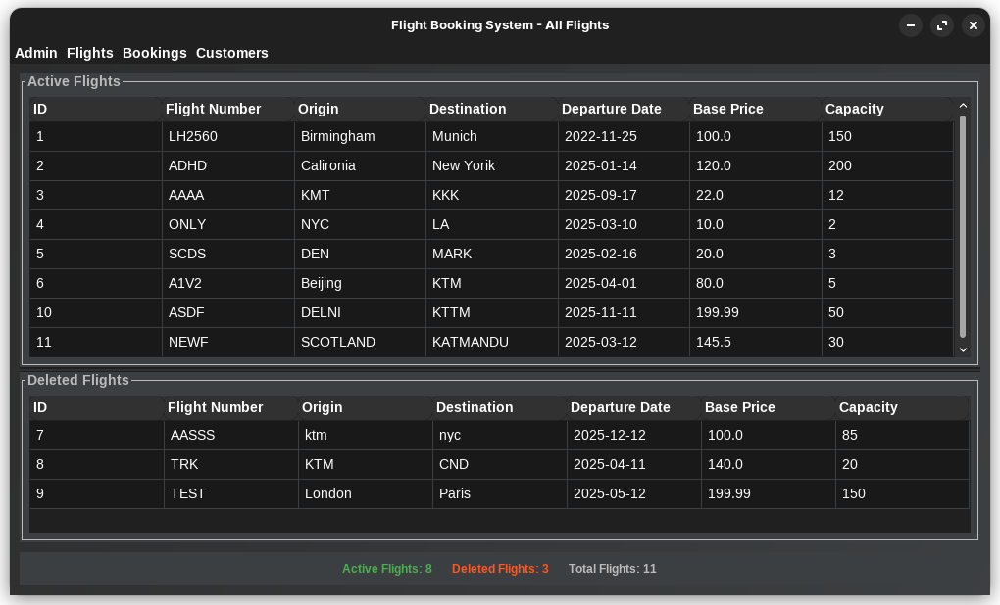

# Flight Booking System 

[](https://www.java.com)
[](https://opensource.org/licenses/MIT)

## 📋 Overview

A robust Java-based flight booking management system offering both CLI and GUI interfaces for efficient flight and booking management.

## ✨ Features

- 🖥️ Dual Interface Support
  - Command-line interface (CLI)
  - Graphical user interface (GUI)
- ✈️ Flight Management
  - Add/Edit/Delete flights
  - View flight schedules
- 🎫 Booking Operations
  - Create/Cancel bookings
  - Manage passenger details
- 💾 Data Persistence
- 🔐 User Authentication

## 🚀 Getting Started

### Prerequisites

- Java JDK 8 or higher
- Any Java IDE (VS Code recommended)

### Installation

```bash
# Clone the repository
git clone https://github.com/yourusername/FlightBookingSystem_final.git

# Navigate to project directory
cd FlightBookingSystem_final

# Compile the project
javac src/bcu/cmp5332/bookingsystem/main/Main.java

# Run the application
java src/bcu/cmp5332/bookingsystem/main/Main
```

## 💻 Usage

### CLI Commands

| Command | Description |
|---------|-------------|
| `help` | Display available commands |
| `loadgui` | Launch GUI interface |
| `exit` | Save and exit |

### GUI Navigation



1. **Main Window**
   - Flight List
   - Booking Management
   - User Controls

2. **Booking Process**
   - Select Flight
   - Enter Passenger Details
   - Confirm Booking

## 🗂️ Project Structure

```
FlightBookingSystem_final/
├── src/
│   └── bcu/cmp5332/bookingsystem/
│       ├── auth/          # Authentication
│       ├── commands/      # CLI Commands
│       ├── data/         # Data Management
│       ├── gui/          # GUI Components
│       ├── main/         # Main Application
│       └── model/        # Business Logic
├── data/                 # Data Storage
└── docs/                 # Documentation
```

## 🛠️ Development

### Building from Source

```bash
# Compile the project
javac -d bin src/bcu/cmp5332/bookingsystem/main/Main.java

# Run from compiled files
java -cp bin bcu.cmp5332.bookingsystem.main.Main
```

### Running Tests

```bash
# Run unit tests
java -cp bin org.junit.runner.JUnitCore bcu.cmp5332.bookingsystem.test.TestSuite
```

## 🤝 Contributing

1. Fork the Project
2. Create your Feature Branch (`git checkout -b feature/AmazingFeature`)
3. Commit your Changes (`git commit -m 'Add some AmazingFeature'`)
4. Push to the Branch (`git push origin feature/AmazingFeature`)
5. Open a Pull Request

## 📝 License

Distributed under the MIT License. See `LICENSE` for more information.

## 👥 Authors

- **Ankit Mahato** - *Initial work* - [GitHub Profile](https://github.com/mahatoankit)

## 🙏 Acknowledgments

- BCU Faculty and Staff
- Open Source Community
- All Contributors

---
*Last Updated: February 23, 2025*
